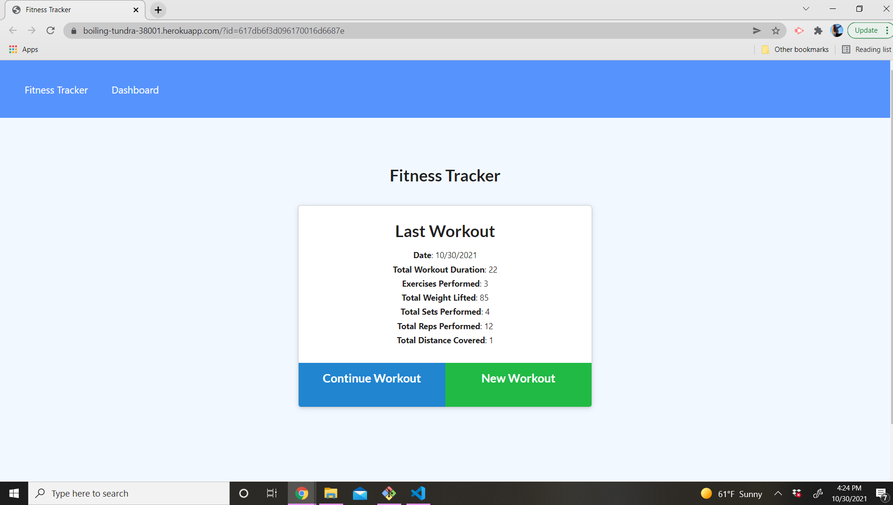
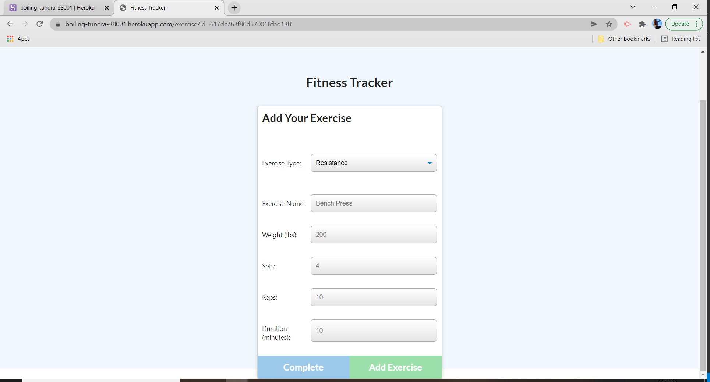
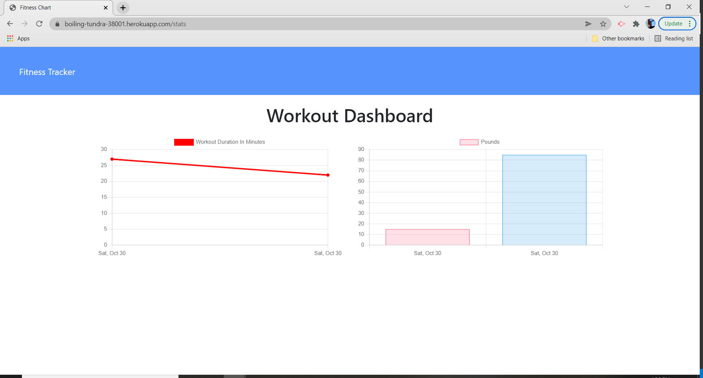

# workout-tracker

## Description 
This app allows users to be able to create and keep track of their workout regimen. Being able to add whether it was resistance or cardio then go forth to add how much time, reps and sets were in the allocated time. 

## Live Link 
https://boiling-tundra-38001.herokuapp.com/?id=617db6f3d096170016d6687e 

## How to get it running on local computer
Clone the repo then npm i in the server terminal to open in localhost 

## Images of how it looks 

## Tech Used

  

(<a href="#top">back to top</a>)
